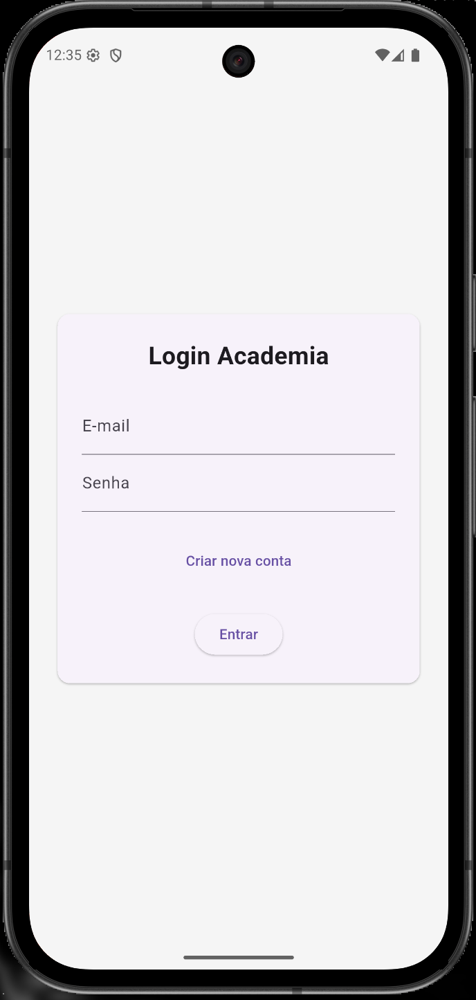

# academia_app

A new Flutter project.

---
# 📱 Preview do App

**Tela inicial do app**

> _Adicione seu print aqui depois!_

---

# ✨ Funcionalidades Implementadas

- Tela de Login com autenticação JWT  
- Tela de Cadastro com seleção de tipo de usuário (`aluno`, `instrutor` ou `gestao`)  
- Home protegida por login  
- Integração via API REST  
- Armazenamento local seguro do token de acesso  

---

# 🧰 Requisitos

- [Flutter (canal stable)](https://docs.flutter.dev/get-started/install) – versão mais recente  
- [Git](https://git-scm.com/) instalado  
- Editor recomendado: **VSCode** ou **Android Studio**  
- Emulador Android/iOS **ou** dispositivo físico com modo desenvolvedor ativado  
- Acesse sua API (**FastAPI**) rodando localmente ou em um servidor acessível  

---

# 🚀 Como Rodar o Projeto do Zero

### 1. Clone o repositório

```bash
git clone https://github.com/wanessasantos360/academia_app.git
cd academia_app
```
### 2. Instale as dependências do Flutter
```bash
flutter pub get
```

### 3. Configure o endpoint da API

No arquivo `lib/core/constants.dart` atualize a variável apiUrl para o endereço correto da sua API, exemplo:

```dart
static const String apiUrl = 'http://SEU_IP_OU_DOMINIO:PORTA/';
   ```


### 4. Rode um emulador ou conecte um celular

- Android Studio: use o “AVD Manager” para iniciar um dispositivo virtual.

- Em dispositivo Android, ative o modo desenvolvedor e depuração USB.

### 5. Execute o app

```bash
flutter run
```

---

# 📝 Estrutura de Pastas

```bash 
lib/
├── core/
├── models/
├── services/
│ ├── auth_service.dart
│ └── user_service.dart
├── views/
│ ├── home/
│ ├── login/
│ └── register/
├── widgets/
├── main.dart
```
---

# ⚠️ Considerações

- Certifique-se de rodar a API backend antes, e que ela está acessível pelo endereço configurado no app teste no nevegador: `urlAPI/127.0.0.1`

- O campo "tipo" do usuário segue as opções padrão: `aluno`, `instrutor` ou `gestao`;


---

# 🖼️ Prints e vídeos
Adicione seus prints aqui usando a sintaxe:

### Legenda de exemplo
daImagem

### Login

